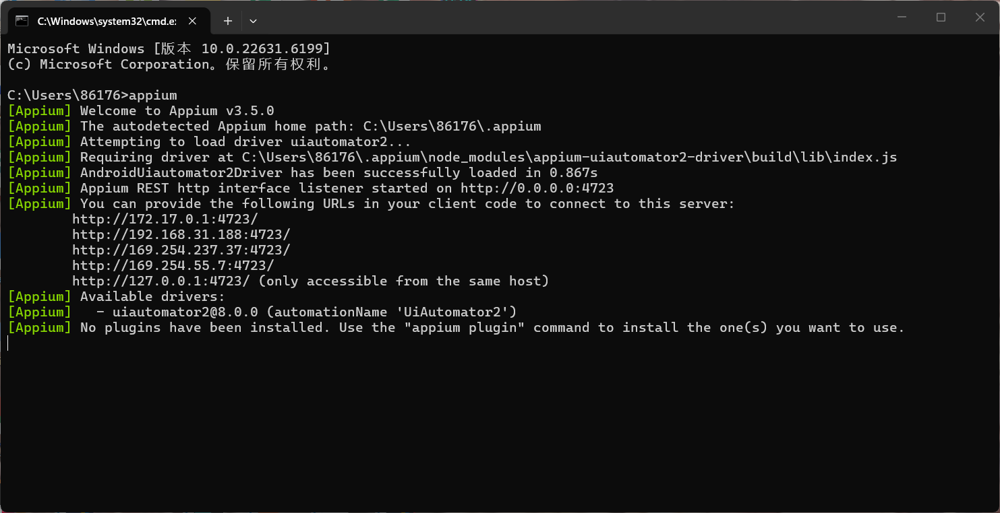
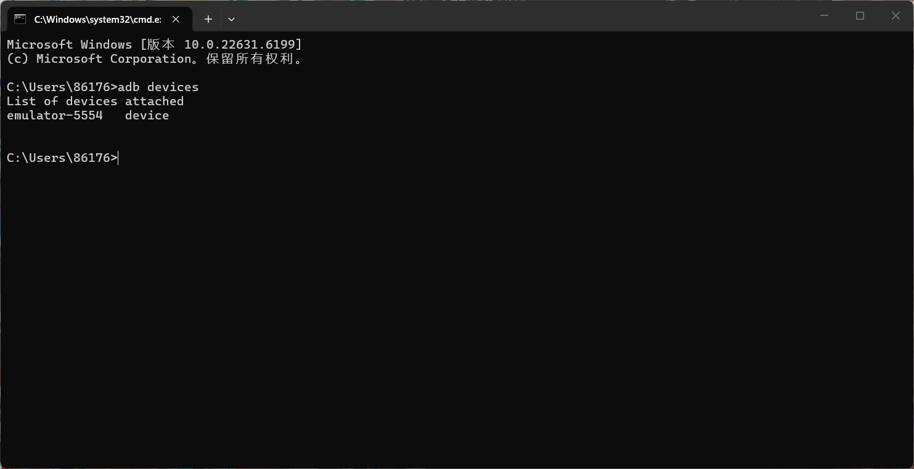
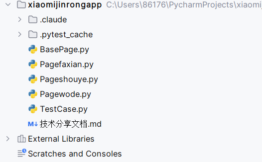
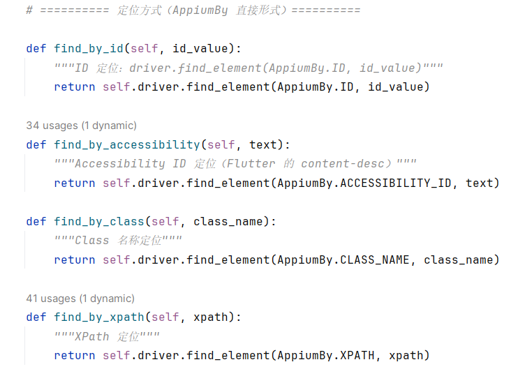
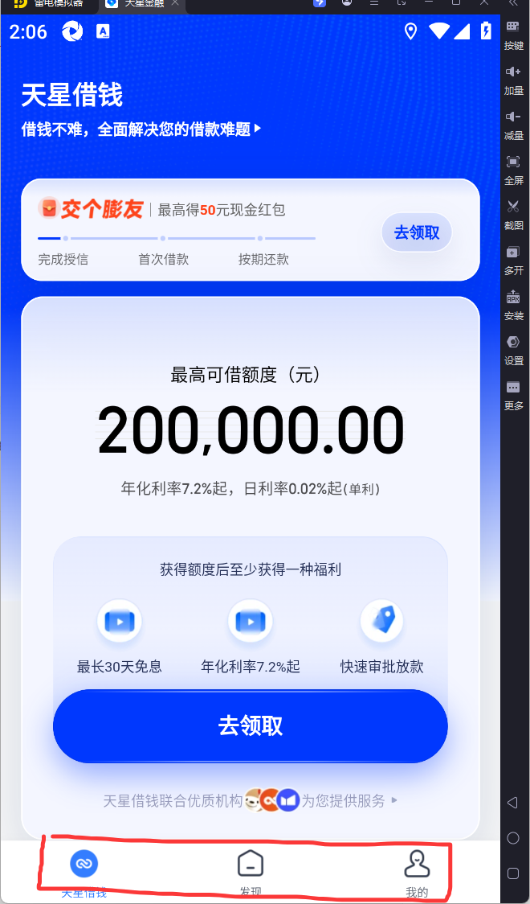
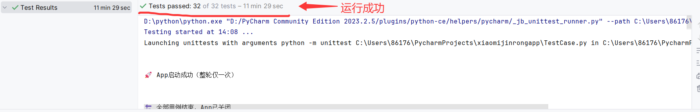
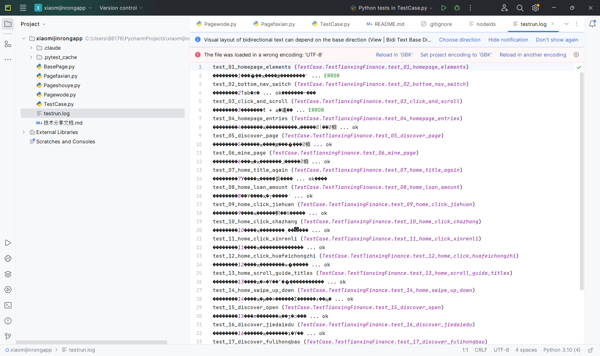

# 《Appium + Python PO 模式》使用分享
——以「天星金融 App 自动化测试」为实战项目

---

## 一、环境准备

### 1.1 工具清单与版本要求

| 工具 | 版本 | 用途 |
| --- | --- | --- |
| Python | 3.9+ | 测试脚本语言 |
| Appium Server | 2.x | 自动化服务端 |
| Appium-Python-Client | ≥ 4.0 | Python 客户端 |
| UiAutomator2 Driver | ≥ 2.0 | Android 驱动 |
| Android Emulator | API 28 (Android 9) | 被测设备 |
| 天星金融 App | `com.xiaomi.jr` | 被测应用 |

> 注:本项目被测 App 是 Flutter 应用,所有可定位文本都以 `content-desc` 形式呈现,而非 `text` 属性。

### 1.2 安装命令

```bash
# 1. 安装 Python 依赖
pip install Appium-Python-Client selenium

# 2. 启动 Appium Server(独立窗口或命令行)
在cmd中输入appium即可

# 3. 启动模拟器(Android 9)
#本项目使用雷电模拟器进行测试
```

### 1.3 安装截图(图文混排)

> 1:Appium Server 启动成功终端界面
> 

> 2:Android Studio 模拟器列表
> 

### 1.4 关键依赖文件示例

```json
// appium-capabilities.json
{
  "platformName": "Android",
  "platformVersion": "9",
  "deviceName": "emulator-5554",
  "appPackage": "com.xiaomi.jr",
  "appActivity": ".app.MiFinanceActivity",
  "noReset": true,
  "automationName": "UiAutomator2"
}
```

---

## 二、核心功能演示

### 2.1 功能一:PO 三层架构(BasePage / Page / TestCase)

**操作步骤:**

1. `BasePage.py` 封装通用操作(等待 / 定位 / 滑动 / 导航)
2. `Pageshouye.py` / `Pagefaxian.py` / `Pagewode.py` 继承 BasePage,定义各页元素
3. `TestCase.py` 用 unittest 编排用例,只调用 Page 对象的方法

>  PyCharm 项目结构
> 

**核心代码 - BasePage 定位方式封装:**

```python
# BasePage.py —— 定位方式封装
from appium.webdriver.common.appiumby import AppiumBy

class BasePage:
    def __init__(self, driver):
        self.driver = driver
        self._implicit_wait = 10  # 默认隐式等待 10s

    def find_by_accessibility(self, text):
        """Accessibility ID 定位(Flutter content-desc)"""
        return self.driver.find_element(AppiumBy.ACCESSIBILITY_ID, text)

    def find_by_xpath(self, xpath):
        """XPath 定位(用于复合文案匹配)"""
        return self.driver.find_element(AppiumBy.XPATH, xpath)
```

### 2.2 功能二：三种元素定位方式

**本项目使用 3 种定位方式：**

表格

| 定位方式         | 适用场景                    | 示例                                     |
| ---------------- | --------------------------- | ---------------------------------------- |
| Accessibility ID | Flutter 元素的 content-desc | `find_by_accessibility("天星借钱")`      |
| XPath            | 复合文案匹配                | `//*[contains(@content-desc,"200,000")]` |
| 坐标点击         | 同名元素区分                | `tap_by_coordinates(x, y)`               |

> 

**核心代码：**

```python
\# Pageshouye.py —— 三种定位方式演示
\# 方式1：Accessibility ID
def title_element(self):
    """页面标题：天星借钱"""
    return self.find_by_accessibility("天星借钱")
\# 方式2：XPath（contains 模糊匹配）
def loan_amount_element(self):
    """额度显示容器"""
    xpath = '//*[contains(@content-desc, "200,000.00")]'
    return self.find_by_xpath(xpath)
\# 方式3：坐标点击（区分同名元素）
def click_main_get_button(self):
    """点击底部蓝色大"去领取"按钮"""
    size = self.driver.get_window_size()
    x = int(size['width'] * 0.50)
    y = int(size['height'] * 0.72)
    self.driver.tap([(x, y)])
```


### 2.3 功能三：页面切换与导航

**操作说明：**

底部导航栏有 3 个 Tab：天星借钱、发现、我的。通过 `open_tab()` 方法切换，内部自动处理同名元素问题。



**核心代码：**

```python
\# Pageshouye.py —— Tab 切换
def click_tianxing_tab(self):
    """切换到底部【天星借钱】Tab"""
    self.click_accessibility("天星借钱")
def click_discover_tab(self):
    """切换到底部【发现】Tab"""
    self.click_accessibility("发现")
def click_mine_tab(self):
    """切换到底部【我的】Tab"""
    self.click_accessibility("我的")
def open_tab(self, tab_name):
    """切换到指定底部 Tab"""
    tab_map = {
        "天星借钱": self.click_tianxing_tab,
        "发现": self.click_discover_tab,
        "我的": self.click_mine_tab
    }
    if tab_name in tab_map:
        tab_map[tab_name]()
```

---

## 三、实战示例

### 3.1 项目背景

天星金融 App(包名 `com.xiaomi.jr`)是小米旗下金融借贷产品,首页 / 发现 / 我的 三个主 Tab,需要对其 UI 元素和入口点击做回归测试。本项目用 PO 模式 + unittest 编排 32 条用例,覆盖元素校验、Tab 切换、滑动、入口点击。

### 3.2 完整操作流程



**步骤 1:启动 App 并建立共享会话(setUpClass)**

```python
# TestCase.py —— 整轮只启动一次 App
@classmethod
def setUpClass(cls):
    options = UiAutomator2Options()
    options.platform_name = 'Android'
    options.app_package = 'com.xiaomi.jr'           # 关键参数
    options.app_activity = '.app.MiFinanceActivity' # 关键参数
    options.no_reset = True                         # 不重置 App 状态
    cls.driver = webdriver.Remote('http://127.0.0.1:4723', options=options)
    cls.driver.implicitly_wait(10)
```

**步骤 2:首页元素验证(test_01)**

```python
# TestCase.py —— 用例 1
def test_01_homepage_elements(self):
    home = Pageshouye(self.driver)
    home.open_tab("天星借钱")          # 复位到首页
    self.assertEqual(home.get_title(), "天星借钱")
    self.assertIn("200,000.00", home.get_loan_amount())
    print("✅ 测试用例1通过:首页元素全部正常显示")
```

**步骤 3:发现页入口点击(test_18,使用 safe_click_entry)**

```python
# TestCase.py —— safe_click_entry:找不到只告警不中断
def test_18_discover_click_kefu(self):
    home = Pageshouye(self.driver)
    faxian = Pagefaxian(self.driver)
    home.open_tab("发现")
    home.safe_click_entry(faxian.kefu, "发现", "智能客服")
    print("✅ 测试用例18通过")
```

### 3.3 最终结果

> 


---

## 四、踩坑记录

### 4.1 坑 1:隐式等待与显式等待叠加

| 项 | 内容 |
| --- | --- |
| **错误现象** | `WebDriverWait(d, 3)` 实际等 30s+ 才判失败 |
| **根因** | 隐式等待=10s 时,显式等待每次 find 都阻塞,叠加相乘 |
| **解决办法** | 用 `_fast_wait` 上下文临时置隐式等待=0 |
| **验证** | 失败用例从 30s 降到 3s |

### 4.2 坑 2:Flutter 同名元素误点

| 项 | 内容 |
| --- | --- |
| **错误现象** | 点击"天星借钱"Tab 无反应,后续用例全部错位 |
| **根因** | 标题与导航同名,`find_element` 命中先渲染的标题 |
| **解决办法** | `find_elements` + `max(y)` 取最靠下元素 |
| **验证** | Tab 切换正确,后续用例复位成功 |

### 4.3 坑 3:StaleElementReference(Flutter 重渲染)

| 项 | 内容 |
| --- | --- |
| **错误现象** | 找到元素后,读 location 或 click 时抛 stale |
| **根因** | Flutter 重渲染极快,元素引用隔一次 HTTP 调用就失效 |
| **解决办法** | "查找→取坐标→点击"整体重试 3 次,任一步抛 stale 重新 find |
| **验证** | `_click_tab` 不再报 stale ERROR |

### 4.4 坑 4:W3C swipe 偶发 InvalidElementStateException

| 项 | 内容 |
| --- | --- |
| **错误现象** | `driver.swipe` 偶发抛异常,把用例搞崩 |
| **根因** | App 未稳定 / UI 无响应 |
| **解决办法** | `_safe_swipe` 包 3 次重试,最后一次放弃但不抛异常 |
| **验证** | 滑动失败不再影响用例结果 |

### 4.5 坑 5:会话失效连锁失败

| 项 | 内容 |
| --- | --- |
| **错误现象** | 一条用例把 App 搞崩,后面所有用例连锁报错 |
| **根因** | 共享 driver 失效后未自愈 |
| **解决办法** | `setUp` 检测 `session_alive`,失效先 `quit` 再 `Remote` 重连 |
| **验证** | 单条崩了之后,下条自动 🚀 重连成功 |

### 4.6 坑 6:整轮冷启动太慢

| 项 | 内容 |
| --- | --- |
| **错误现象** | 6 条用例 = 6 次冷启动 App,总耗时 > 5 分钟 |
| **根因** | 每条用例 setUp 都新建会话 |
| **解决办法** | `setUpClass` 建共享会话,用例间用 `open_tab` 复位 |
| **验证** | 整轮耗时降到 ~1 分钟 |

---

## 五、总结

### 5.1 工具优缺点

**优点:**
- PO 三层分离,元素定位与用例编排解耦,维护成本低
- Appium 跨平台跨语言,生态成熟,Flutter 应用可借 `content-desc` 定位
- 上下文管理器优雅处理隐式/显式等待叠加问题

**缺点:**
- Flutter 应用元素无 `resource-id`,大量依赖 XPath,速度慢且脆弱
- 隐式/显式等待坑多,新人不踩一次很难意识到
- 共享会话提升速度但增加耦合,需配套失效自愈机制

### 5.2 适用场景

- ✅ 中小型 Native / Flutter 应用的 UI 回归测试
- ✅ 元素稳定、文案固定、入口多的金融 / 电商类 App
- ✅ 需要快速验证主流程不崩的冒烟测试
- ❌ 高度动态化、H5 占比高的应用(建议改用 Playwright / WebView 调试协议)
- ❌ 强性能敏感场景(Appium HTTP 桥接开销大)

### 5.3 后续优化方向

- 引入 Allure 生成可视化报告
- 用 pytest 替换 unittest,获得 fixture / parametrize 能力
- 把 XPath 定位逐步迁移到 `testID`(配合开发侧改造)
- 接入 CI(GitHub Actions / Jenkins)做每日回归
